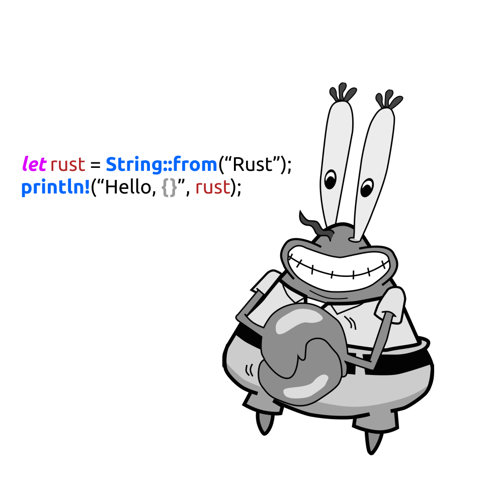

# Let's learn Rust! :D

Rust is an amazing programming language. It has been loved by many programmers(according to Stack Overflow surveys and the colossal companies like Dropbox, Atlassian etc) since its philosophical goal of writing secure and robust code. 

This repository will be a homework note for learning Rust from the best Rust tutorial book, **"The Rust Programming Language"** by Steve Klabnik and Carol Nichols. Hope you(and me) enjoy learning it!
